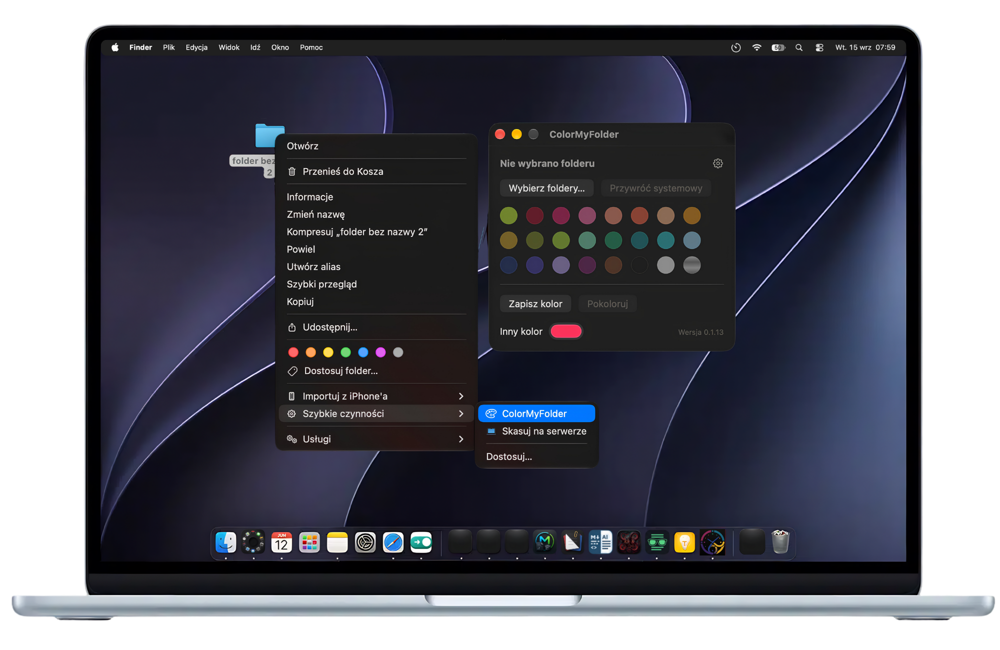

<p align="center">
  
</p>

## ColorMyFolder

**Any color for any folder — in the macOS folder look.**

A small macOS app that colors individual folders in Finder with any color you pick,
not just the seven tag colors.

[](https://developer.apple.com/xcode/)
[](https://www.apple.com/macos)
[](LICENSE)

<a href="https://github.com/sponsors/mikagosz"></a>

macOS lets you tint folders in only two ways: one of seven tag colors per folder, or one
system-wide folder color in *System Settings → Appearance* that changes every folder at once.
ColorMyFolder gives a single folder its own color, and keeps it looking like a real macOS
folder: the same gradient and shading, and the paper sheet that appears only when the folder
has something in it.

> The interface is in English and Polish and follows the language of your system.

---

## Screenshot

<p align="center">
  
</p>

---

## How to use it

1. In Finder, right-click a folder (or several) → **Quick Actions → ColorMyFolder**.
   The same item is also under **Services**.
2. Click one of your saved colors, or pick any color with **Other Color** and click
   **Color Folder**. Besides plain colors there are black, white and a metallic chrome.
3. **Save Color** keeps the current color in the palette; right-click a saved color →
   **Delete Color** removes it. **Restore System Look** gives the folder back its normal icon.

If a folder already has a custom icon that ColorMyFolder did not set (one you pasted in
*Get Info*, for example), ColorMyFolder asks before replacing or removing it — it cannot bring
that icon back afterwards.

You can also open ColorMyFolder from Applications (or Spotlight) and use **Choose Folders…**
in its window. The gear in the corner shows where the list of colors is kept and lets you
move it.

The window stays open until you close it or pick a color, so a stray click on the desktop
does not dismiss it.

## How it works

- The icon is built from the same parts Finder uses for its own folders — the back flap, the
  front flap and the paper sheet from macOS itself — with the flaps recolored so the
  system gradient and shading stay intact. Nothing is drawn from scratch.
- The finished icon is set as the folder's custom icon.
- ColorMyFolder runs in the background (no Dock icon) and starts at login. It watches the
  colored folders and redraws an icon only when a folder goes from empty to non-empty or
  back, so the paper sheet behaves like Finder's own.

## Your colors on more than one Mac

On first launch ColorMyFolder asks where to keep its list of saved colors and colored
folders. It creates a hidden `.ColorMyFolder` folder in the place you choose and keeps one
JSON file there. Choose a folder you sync between your Macs — iCloud Drive, Syncthing
or anything else — and every Mac gets the same saved colors and the same colored folders. Paths are
stored relative to your home folder, so different account names are fine. If a sync tool
carries the folder's icon file but not the Finder flag that turns it on, ColorMyFolder on the
other Mac simply redraws the icon.

To move the list somewhere else later, use the gear in the ColorMyFolder window.

## Requirements

- macOS 26 or later
- Xcode 27 to build

## Installing

**Download:** the ready-made app is on the
[ColorMyFolder page at fractal8.eu](https://fractal8.eu/program?p=colormyfolder&lang=en). Unzip it
and move `ColorMyFolder.app` to Applications. The app is not notarized with Apple, so macOS blocks
it the first time you open it — go to *System Settings → Privacy & Security* and click
**Open Anyway**.

**Or build it from source:**

```bash
git clone https://github.com/mikagosz/ColorMyFolder.git
cd ColorMyFolder
./build.sh
```

The script runs the logic check, draws the app icon from the macOS folder parts, builds the app, installs it to `~/Applications`, adds the
quick action and starts ColorMyFolder. It signs the app ad hoc, which is all you need for an
app you built yourself. To install into a different folder, put its path on the first line of
a file named `.install-dir` in the project folder.

The logic check can also be run on its own, without Xcode: `./Tests/check.sh`.

## First launch

- ColorMyFolder first looks for a list you already use on another Mac: in your home folder,
  Desktop, Documents and iCloud Drive, and one level of folders inside each. macOS may ask
  whether ColorMyFolder can access your Desktop, Documents or iCloud Drive. If you say no, it
  simply does not look there — and it cannot keep the paper sheet right on colored folders there.
- Then it asks where to keep its list of colors and colored folders. Pick any folder;
  choose a synced one if you use more than one Mac (see above). If you cancel, the window
  works, but nothing is saved until you choose a place with the gear.
- macOS shows a notification that a login item was added — ColorMyFolder has to run in the
  background to switch the paper sheet when folders fill up or empty. It adds itself once; if
  you turn it off in *System Settings → General → Login Items*, it stays off.
- If the ColorMyFolder item in Finder shows a generic document icon instead of the palette,
  relaunch Finder: hold Option, right-click Finder in the Dock and choose **Relaunch**.

## Uninstalling

1. Give your folders their normal look back with **Restore System Look** (the custom icon stays
   on a folder otherwise).
2. Quit ColorMyFolder in Activity Monitor and remove it from *System Settings → General → Login Items*.
3. Delete `ColorMyFolder.app`, `~/Library/Services/ColorMyFolder.workflow`, the settings file
   `~/Library/Preferences/com.mikagosz.ColorMyFolder.plist` and the hidden `.ColorMyFolder`
   folder in the place you chose on first launch.

## Privacy

ColorMyFolder never connects to the network and sends nothing anywhere. On your Mac it:

- writes the icons of the folders you color and reads what is in them (to know whether a
  folder is empty),
- reads and writes its own list file in the folder you chose,
- on first launch, looks for an existing list in your home folder, Desktop, Documents and
  iCloud Drive (one level deep) — it only checks whether a `.ColorMyFolder` folder is there,
- installs its quick action in `~/Library/Services`, adds itself to Login Items once and keeps
  its settings (the list's place) in `~/Library/Preferences`.

## Licence

The source code is released under the [MIT licence](LICENSE).

The application artwork is not covered by it — see [NOTICE](NOTICE). The folder parts (also used
for the app icon, which `Tools/make-icon.swift` draws at build time) and the `paintpalette`
symbol are Apple's; they are read from macOS and are not part of this repository.
